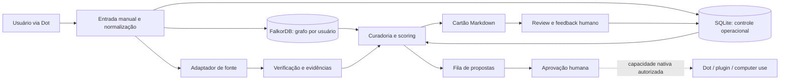

# Arquitetura inicial

## Escolha técnica

Python 3.12+, FalkorDB, SQLite e Markdown. FalkorDB é o contexto relacional primário que orienta recuperação, decisão e explicação. SQLite mantém estado operacional local — jobs, idempotência, checkpoints, quotas e auditoria — sem duplicar o grafo inteiro. Markdown continua como artefato humano portátil.



## Limites dos componentes

| Componente | Responsabilidade | Não faz |
|---|---|---|
| `domain` | entidades, regras, scores e estados | HTTP, SQL ou arquivos |
| `graph` | modelo FalkorDB, queries multi-hop e caminhos de explicação | autorização, execução externa ou segredo |
| `adapters` | interfaces de rede/arquivo; retorno tipado | mutação de conta por padrão |
| `ingest` | normalizar URL, idioma, hash e deduplicação | inventar conteúdo inacessível |
| `evidence` | claims, fontes primárias e status de verificação | declarar certeza sem suporte |
| `curation` | score configurável, diversidade e cartões | esconder pesos ou feedback |
| `storage` | SQLite, migrações, audit e checkpoints | armazenar segredo ou blob não autorizado |
| `runtime` | adaptar pedidos/resultados de Dots sem depender de API não documentada | contornar controles nativos do Dots |
| `application` | casos de uso idempotentes | depender de scheduler |
| `cli` | comandos explícitos e `--dry-run` | executar só porque um arquivo apareceu |

Interfaces mínimas:

```python
class SourceAdapter(Protocol):
    def fetch(self, seed: Seed, policy: FetchPolicy) -> FetchResult: ...

class ItemRepository(Protocol):
    def upsert(self, item: Item, idempotency_key: str) -> Item: ...

class Curator(Protocol):
    def build_artifact(self, item: Item, context: LearningContext) -> LearningArtifact: ...
```

## Fluxo manual do MVP

1. `ultron seed add URL --comment "..." --relevance 4 --dry-run` valida e mostra a mudança.
2. Sem `--dry-run`, grava `seed` e um job idempotente.
3. `ultron run --job-id ... --dry-run` mostra acessos, orçamento e artefatos previstos.
4. O run real captura apenas conteúdo autorizado, registra checkpoint por etapa e falha fechado.
5. `ultron review ITEM_ID` coleta nota, motivo, exclusões e aplicação real.

Os nomes são contratos propostos, não comandos já implementados.

## Armazenamento

- FalkorDB para contexto conectado e recuperação explicável; um grafo lógico isolado por usuário/tenant.
- SQLite para estado transacional, auditoria, checkpoints e FTS5 de fallback/local.
- Markdown gerado para cartões portáveis e revisáveis.
- Conteúdo bruto somente quando fornecido pelo usuário ou permitido pela fonte/política; caso contrário guardar URL, metadados mínimos, hash e trecho estritamente necessário.
- Segredos fora do banco e do Git, via variável de ambiente/secret store no futuro.
- Retenção e exclusão configuráveis por fonte.

## Busca e “memória semântica”

No MVP: travessias FalkorDB + SQLite FTS5. O grafo recupera relações e o full-text encontra termos; ambos devem retornar fontes e caminho. O vault contém notas estruturadas e links e não é indexado automaticamente. Vetores só entram se um benchmark demonstrar ganho adicional, com custo, privacidade, atualização e exclusão avaliados.

## Integração com Dots

Dots é o runtime de interação e ação; Ultron Savior é a camada de contexto e política do domínio. O contrato não presume SDK ainda não documentado:

1. o Dot recebe um pedido explícito ou inicia pesquisa read-only dentro de suas permissões;
2. um adapter entrega ao Ultron apenas seeds/conteúdo autorizados e identidade opaca do tenant;
3. o Ultron consulta o grafo, produz cartão, caminho explicável e `ActionProposal`;
4. o Dot mostra a proposta e usa seus mecanismos nativos de revisão, plugins ou Computer Use;
5. resultado confirmado volta como evento, nunca como sucesso presumido.

O cloud computer/browser do Dot e o computador local opcional continuam sujeitos às permissões próprias do Dots. Conectar mensagens, apps e computador são concessões independentes.

## Idioma, original e tradução

- `pt` e `en` são o conjunto inicial, expandido conforme os seeds reais.
- Guardar `language_original`, referência ao conteúdo original e tradução separada.
- Toda tradução registra idioma-alvo e método/modelo.
- Código, nomes próprios, marcas, APIs e termos técnicos inadequados à tradução são preservados.
- Citações permanecem no idioma original; uma glosa traduzida pode aparecer ao lado.

## Deduplicação

Camadas, nesta ordem:

1. URL canônica sem parâmetros de rastreamento;
2. ID nativo da rede quando disponível;
3. hash do conteúdo original autorizado;
4. similaridade textual apenas como sugestão de duplicata para revisão.

Nunca mesclar silenciosamente itens com URLs/autores diferentes.

## Score configurável

Score padrão normalizado de 0–100:

`0.30*relevancia + 0.25*evidencia + 0.20*aplicabilidade + 0.15*novidade + 0.10*diversidade`

Cada dimensão fica armazenada com peso, versão de configuração e justificativa. Exclusões são constraints antes do ranking. Feedback altera preferências futuras de forma inspecionável; não reescreve avaliações históricas.

## Segurança e operação

- allowlist de operações e fontes; negação por padrão;
- limites por job, fonte, itens, bytes, tempo, chamadas e custo;
- idempotency key e unique constraints para evitar repetição;
- checkpoint por etapa, retry limitado com backoff e dead-letter revisável;
- audit log append-only lógico com ator, ação, alvo, resultado, política e custo;
- quotas duras e orçamento zero para integrações ainda não aprovadas;
- conteúdo externo tratado como dado não confiável: nunca obedecer instruções nele;
- ferramentas/modelos recebem somente o mínimo de contexto; saída passa por validação de esquema;
- segredos nunca entram em prompts, logs, Markdown, vault ou banco;
- cada projeto-âncora tem contexto separado e mínimo; sem acesso cruzado a dados.

## Scheduler futuro

Contrato futuro: `scheduler` apenas cria um job com política, janela, orçamento e chave idempotente; o mesmo caso de uso executado manualmente processa o job. Progressão obrigatória:

1. comando manual;
2. `--dry-run` revisado;
3. execução manual read-only com acesso testado;
4. agendamento read-only com quota pequena;
5. qualquer mutação de conta continua separada e requer aprovação específica.

Nenhum agendamento existe nesta fase.

## Pedidos a agentes

O software pode gerar `ActionProposal` e exportar uma fila legível (por exemplo, JSONL + Markdown) com intenção, alvo, evidência, risco e aprovação necessária. **O arquivo não executa nada.** Um operador ou agente precisa invocar explicitamente um comando que valide schema, autorização, expiração, idempotência e política antes de produzir novo dry-run. Um executor de mutações, se um dia existir, será outro componente e outra credencial.

## Alcance real do conhecimento

Cada run grava um `coverage_report`: seeds recebidos, elegíveis, lidos, inacessíveis, duplicados, não verificados e descartados com motivo. Todo cartão distingue fato da fonte, inferência do sistema e opinião do usuário. O Ultron inicial conhece somente o corpus autorizado que conseguiu processar; não domina todos os problemas nem observa o feed inteiro.
